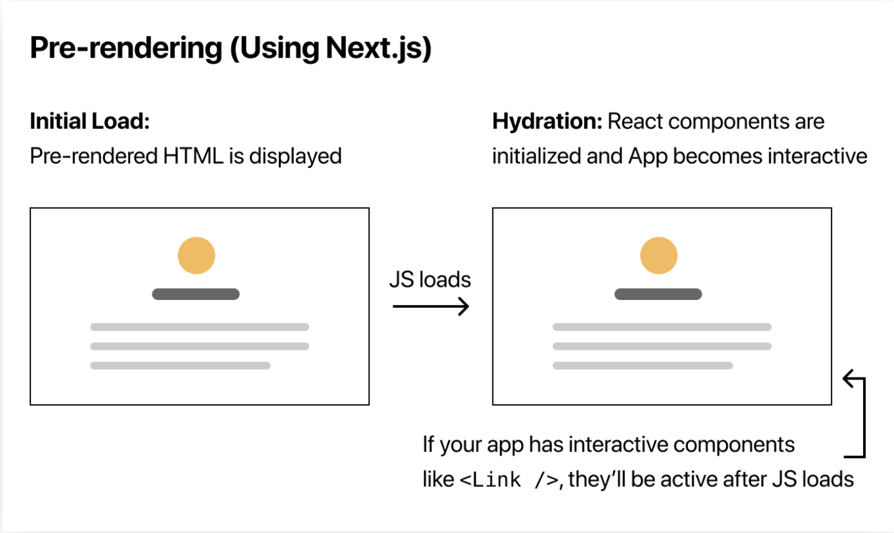
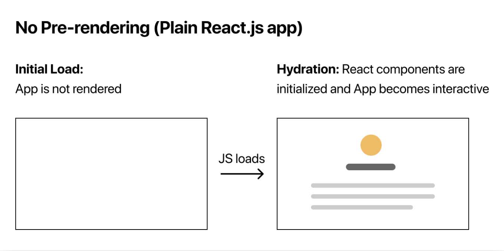

## Link 태그 
whenever Link components appear in the browser’s viewport, 
Next.js automatically prefetches the code for the linked page in the background. 
By the time you click the link, the code for the destination page will already be loaded in the background, 
and the page transition will be near-instant!
 
 
링크 태그를 사용하면, 리액트처럼 클라이언트 사이드 렌더링이 이루어진다. 
더군다나 공식 문서에 따르면, 서버사이드 렌더링에 의해서 페이지가 불러와져 있을 때, 
그 페이지 안에 Link 태그가 있다면 background 상에서 이미 해당 페이지를 load 해온다.
때문에 Link를 통해서 페이지를 이동 했을 때는, 이미 해당 페이지가 load되어 있는 상태이기 때문에 상당히 빨리 이동할 수 있다. 
넥스트.js는 알아갈 수록 매력적이라는 생각이 든다. 

 

## Image 태그 

next.js는 기본적으로 이미지 최적화를 진행한다. 이 때 이미지 태그를 활용한다.   
또한 이것은 유저가 해당 이미지를 요청할 때, 최적화를 진행하기 때문에, 
정적 사이트와는 다르게, 빌드타임의 속도에 전혀 지장을 주지 않는다. 이미지가 10개든 10만개든 아무 상관이 없다. 
기본적으로 Lazy Load가 적용되는 것이다. (대박!)

[이미지 최적화](https://nextjs.org/docs/basic-features/image-optimization)

 

## Script 태그 

head의 script 부분에 cdn을 넣을 수 있다. 하지만, 그렇게 하면 render-blocking으로 인해 성능상의 문제가 생길 수 있다. 
이를 위해서 next.js는 Script태그를 지원한다. 
[스크립트](https://nextjs.org/docs/basic-features/script)

 

## Pre-rendering 

 
기본적으로 next.js는 모든 페이지를 pre-render한다. 이 말은 client-side에서 페이지를 렌더하지 않는다는 말이다. pre-rendering은 성능과 SEO측면에서 훨씬 낫다.   
 
그리고 이것을 통해서 자바스크립트 없이도, 페이지를 렌더링할 수 있다. 만약 당신이 순수 리액트만으로 페이지를 구현한다면, 자바스크립트 없이는 페이지를 로드할 수 없을 것이다.   

 

 

 

---

## Pre-rendering의 2가지 방식 : Static Generation 과 Server-side Rendering 

[Static Generation](https://nextjs.org/docs/basic-features/pages#static-generation-recommended) 은 빌드타임에 다 로드한다.  
[Server-side Rendering](https://nextjs.org/docs/basic-features/pages#server-side-rendering) 은 매 request마다 로드한다.  

 

넥스트 js를 사용하면, 매 페이지마다 우리는 어떤 방식으로 로드할 지 결정할 수 있다. 

 

가능하면 Static Generation을 사용할 것을 추천!   
We recommend using Static Generation (with and without data) whenever possible because your page can be built once and served by CDN, which makes it much faster than having a server render the page on every request.

 

페이지를 작성할 때마다 다음과 같은 질문을 스스로에게 물어보기. 
"Can I pre-render this page ahead of a user's request?"   
If the answer is yes, then you should choose Static Generation.

 

Static을 사용하면 좋지 않은 경우 :  
On the other hand, Static Generation is not a good idea if you cannot pre-render a page ahead of a user's request.  
Maybe your page shows frequently updated data, and the page content changes on every request.