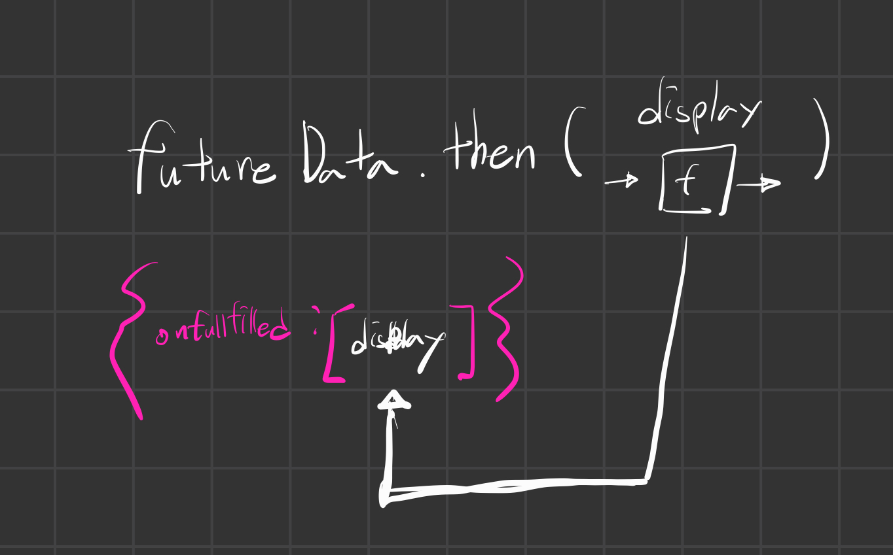

# Promise Introduction

web browser에서 제공하는 기능들이 있었다.
그런데 이 기능들이 동작하는 것들을 우리가 추적할 수 있을까?  
그렇게 할 수 없는 것들이 있었는데,  
fetch의 경우에는 다르다.

이 fetch는 network request 작업을 브라우저 엔진에서 진행한 다음,
자바스크립트의 메모리 상에 특별한 object를 부여한다.
그 object는 바로 Promise이다.  
그리고 웹브라우저에서는 이 Promise 내부의 상태를 지속적으로 업데이트 해준다.  
이 웹브라우저 내부에서 일어나는 작업과 Promise는 아주 긴밀하게 연결되어있어서,
그것의 상태가 지속적으로 업데이트 되는 것이 가능해진다.

### Solution (Promise)

Using two-pronged 'fecade' functions that both:

- initiate background web browser work and
- Return a placeholder object(promise) immediately in Javascript

<pre>
<code>
function display(data){
    console.log(data)
}

const futureData = fetch('http://twitter.com/will/tweets/1')
futureData.then(display);

console.log('Me First!')
</code>
</pre>

여기 이 fetch라는 기능이 internet에게 말한다. 데이터를 가져오라고. web browser 상에서 일어나는 일이다.  
맹세컨데, 이것은 자바스크립트의 기능이 아니다.  
그런데 그 즉시 이 fetch는 Promise라는 object를 반환하는데,  
그 Promise에 즉각적으로 web browser상에서 일어나는 일들의 상태를 받아볼 수 있게된다.  
이것은 자바스크립트 내부에 반영되는 일이다.

 

# Promises Example : fetch

위 코드의 예시로 하나씩 살펴보자.

1. display를 저장하고, futureData도 저장한다.
2. fetch가 실행되면서 이 fetch는 특별한 object 인 Promise를 반환한다.
3. 그래서 이 Promise에 각종 browser내부에서 진행되는 networt 정보들이 업데이트된다.
4. 그리고 이 fetch는 또 다른 한 갈래의 길을 web browser에 내놓는다. 그 web browser 안에서 network request가 진행된다.
5.

다시 말하지만, web browser 내부에서는 각종 일들이 일어날 것이다.  
트위터의 서버에 http request를 보내고 응답을 받아올 것이다.  
그렇게 받아온 응답은 어디에 저장되는가?  
promise 객체의 value 파트에 저장될 것이다.  
그 저장되는 것이 무엇인가? The response data.  
이것이 언제 응답이 오던지 간에, 오늘 오던지, 내일 오던지 간에,  
응답이 오는 그때에 web browser 상에 있던 response data가  
javascript promise object 내부에 저장된다.  
아주 신기한 일이다.

 

# Promise Example : then

promise의 놀라운 기능이 하나 더 있다.
promise 객체는 value라는 키값을 가지고 있었다.  
그리고 하나 더 있었는데,  
onFullfilled 라는 키값이다.  
이 onFullFilled라는 키는 배열을 받는데, 이 배열에는 함수가 들어갈 수 있다.

그리고 여기서 놀라운 사실은 value에 response data가 들어오는 그 순간에,
onFullfilled 안에 있던 함수를 trigger할 수 있다는 것이다.  
더 나아가서 value의 데이터를 onFullfilled의 함수의 파라미터에 곧바로 넣을 수가 있다.

자 근데 onfullfilled에는 배열이 저장되어 있다고 했는데,  
그러면 onfullfilled.push 와 같은 방식으로 값을 저장할 수 있을까?  
그건 안된다. 왜냐하면 이것은 hidden property이기 때문이다.  
자바스크립트가 그렇게 만들어뒀기 때문에 그렇게 이해하고 사용하면 된다.

그리고 우리가 이 onfullfiled 함수를 사용하려고 할 때,  
사용하면 되는 키워드는 then이다.  
근데 이 then이라는 키워드는 도대체 어디서 왔을까?  
promise 객체 안에는 안보이는데 말이다.  
이건 다음시간에 다뤄보도록 하자.

자, 아래 그림은 then에 함수를 넣었을 때,
그 함수가 promise 객체의 onfullfiled에 저장되는 것을 보여주는 그림이다.

다시, 위 코드가 실행되는 순서를 생각해보면,  
우선 fetch를 통해서 promise 객체가 반환되고,  
그 다음 1ms 가 지나고 나면 console.log('me first')가 실행될 것이다.  
그리고 예를 들어 270ms 뒤에 트위터 서버로부터 'hi'라는 메시지가 도착했다.  
그러면 이 메시지 데이터 그러니까 response data는 어디에 저장되는가?  
on completion에 futureData.value 에 저장된다.  
그러면 이 value에 값이 저장되고나면 무슨 일이 일어나는가?  
onfullfilled의 함수가 실행되는데, 이 함수가 실행될 때,  
value의 값을 인자로 가져와서 사용한다.

그런데, 우리가 알다시비 onfullfilled 함수에 등록되어있던 display 함수이다.  
그리고 이 함수는 console.log를 하기 때문에,  
이 우리가 받아온 hi 라는 string data를 출력할 것이다.

270ms 에 'hi'라는 데이터가 출력될 것이다.

### then method and functionality to call on completion

Any code we want to run on the returned data must also be saved on the promise object  
Added using .then method to the hidden property 'onFullfilment'
Promise object will automatically trigger ther attached function to run (with its input being the returned data)

 

# Web API & Promises Example : fetch

이제 우리가 마지막으로 살펴볼 코드다.  
아마도 지금까지 살펴봤던 코드중에서 가장 복잡해보이는 코드일 것 같다.

<pre>
<code>
function display(data){console.log(data)}
function printHello(){console.log('Hello')}
function blockFor300ms(){}

setTimeout(printHello, 0);

const futureData = fetch('https://twitter.com/will/tweets/1')
futureData.then(display)

blockFor300ms()
console.log('Me First!')
</code>
</pre>

- 내가 궁금한 것은 fetch에서 일어나는 일과  
  callback queue는 어떤 관계가 있을까?

- blockFor300ms에 있을 때, 만약 network에서 응답이 와서, promise 객체에 응답이 도착하면 어떻게 될까?

- display 함수 그러니까, onFullfilment에 있는 함수는 실행될 때 callStack에 올라갈까? 아니 callstack에 올라가지 않는다.

  - 이 함수는 callback queue에 올라가게 될 것이다.

- 한번 더 중요한 포인트. console.log('Me First!!')까지 끝나고나면, 이제 event Loop는 callback queue가 실행될 준비가 끝났다고 판단한다. 그러면 바로 printHello를 실행할까? 아니다.
  - 사실은 또 다른 하나의 큐가 더 존재한다. 일반적으로 callback queue는 task queue라고 불리는데, 또다른 microtask queue라는 것이 또 존재한다.
  - 그리고 display이 함수는 microtask queue에 들어가있다. 이 함수는 270ms에 들어갔다고 우리는 전제를 했다.
  - 결론적으로 event loop는 microtask queue에 있는 함수를 먼저 call stack에 올린다. 그래서 display에 callstack에 올라가고 그 인자 'hi'도 함께 올라갈 것이다.
  - 이제 microtask queue가 비어있게 될 것이고, 그러면 이제 event loop는 task queue를 살펴보게 될 것이다. 그래서 printHello 함수를 call stack에 올리게 된다.

기억해야할 것은 promise의 onFullfilment에 있는 함수는 그냥 callback에 들어가지 않는다.  
micromask callback queue에 들어간다는 사실을 기억하자.

그리고 event loop는 call stack이 비었다는 사실이 확인되면,  
가장 먼저확인하는 callback queue는 microtask queue이다.

이것이 이번 강의의 중요한 포인트이다.

 

# Promises Review

우리가 이렇게 배웠던 내용들을 모를때의 단점 :

- 99% of developers have no idea how they're working under the hood
- Debugging becomes super-hard as a result
- Developers fails technical interviews

장점 :

- Cleaner readable style with psedue-synchronous style code
- Nice error handling process

### we have rules for the execution of our asynchronously delayed code

1. Hold promise-deferred functions in a microtask queue and callback function in a task queue(Callback queue)
   when the Web Browser Feature(API) finishes.

2. Add the function to the Call stack(i.e. run the function ) when :

- Call stack is empty & all global code run (Have the Event Loop check this condition)

3. Prioritize functions in the microtask queue over the Callback queue.

 
 
 

# 새롭게 알게된 단어 및 문장 :

- is desire to say : 하고 싶은 말이다.
- two pronged : 두 갈래의
- myriad : 무수히 많음, 무수한
- we want to put on for a while : 우리는 잠시 동안 입어보고 싶다.

참고자료 : [https://www.youtube.com/watch?v=hIFkCrkkHMg]
