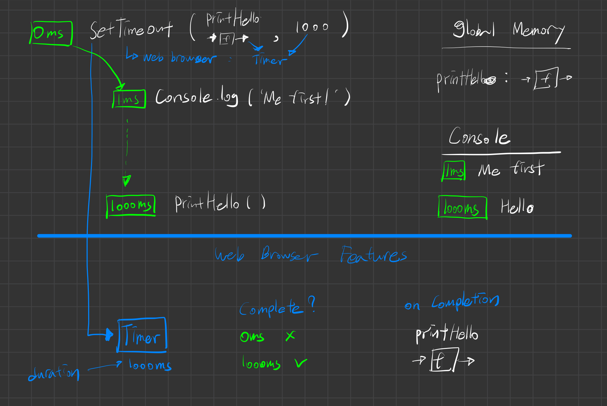

# Single Threaded Execution Review

자바스크립트가 synchronous language라는 말은 한번에 한줄씩 실행하고, 그 한줄을 끝마치고나면 다음 줄을 실행한다는 의미다.
한 줄을 끝내기 전에는 다음 줄로 넘어가지 않는 것이 자바스크립트라는 사실을 기억하자.

 

# Asynchronicity in JavaScript

### Asynchronicity is the backbone of modern web development in Javascript yet..

JavaScript is :

- Single threaded (one command runs at a time)
- Synchronously executed (each line is run in order the code appears)

So what if we have a task :

- Accessing Twitter's server to get new tweets that takes a long time.
- Code we want to run using those tweets

Challenge : We want to wait for the tweets to be stored in tweets so that they're there to run displayTweets on - but no code can run in the meantime.

문제가 되는 것은 트위터의 정보를 불러오는데까지 많은 시간이 걸린다는 것이다.  
그리고 싱글 스레드인 경우 해당 코드가 완료되기 전까지 다음 코드로 넘어갈 수 없으니,
그것이 문제가 되는 상황인 것이다.  
자바스크립트에서는 다음 코드로 넘어갈 수가 없다. 그게 문제다!!
 

### Slow function blocks further code running

<pre>
<code>
const tweets = getTweets('http://twitter.com/wiil/1')

// 350ms wait while a request us sent to Twitter HQ 

displayTweets(tweets)

// more code to run
console.log('I Want to runnnn!')
</code>
</pre>

### what if we try to delay a function directly using setTimeout?

<pre>
<code>
function printHello(){
    console.log('Hello');
}

setTimeout(printHello, 1000);
console.log('Me first!')
</code>
</pre>

이 코드를 우리가 지금까지 이해해온 자바스크립트의 상황에서 보자면,  
me first는 hello가 출력된 다음에 그러니까 1초뒤에 출력될 것이다.  
아니 그러면 아래의 코드는???

<pre>
<code>
function printHello(){
    console.log('Hello');
}

setTimeout(printHello, 0);
console.log('Me first!')
</code>
</pre>

이번에는 실제 상황에서 한번 설명해보자.
지금까지 배웠던 자바스크립트의 가정을 벗어나서.  
실제로 이 코드에서 일어나는 일은  
0초 뒤에 실행되는 것임에도 불구하고,  
me first가 먼저 출력되고, hello가 다음에 출력될 것이다.  
이게 무슨일일까?

이런 현상을 이해하기 위해서 조금 더 알아야 할 지식이 있다.
계속해서 설명해보자.

### JavaScript is not enough - We need new pieces (some of which aren't JavaScript at all)

Our core JavaScript engine has 3 main parts:

- Thread of execution
- Memory/variable environment
- Call stack

We need to add some new components :

- Web Browser API/Node background APIs
- Promises
- Event Loop, Callback/Task queue and micro task queue.

자바스크립트만으로는 충분하지 않으니, 조금더 추가되어야 할 스펙이 있다.  
그리고 그 스펙들에 대해서 지금부터 상세하게 알아가보자.

 

# Asynchronous Browser Features

우리의 코드는 어디에서 실행되는가?
우리의 코드는 자바스크립트에서 실행되는 것이 아니라,
브라우저 상에서 코드가 실행된다.  
자, 그리고 브라우저는 그저 자바스크립트만 존재할 때보다 더 많은 것을 제공해준다.

자바스크립트는 자바스크립트만으로 존재하지 않는다.
자바스크립트 엔진이 있고, 거기에 더해서 브라우저 엔진까지 존재한다.

자바스크립트에는 없지만,
브라우저에는 있는 것에는 무엇이 있을까?

- console
- 웹소켓.
- network request - XHR / Fetch
- rendering - HTML DOM
- Timer - setTimeout

위의 리스트가 자바스크립트가 가지고 있지 않는 것이다.
이 기능들은 자바스크립트의 기능인 것처럼 보였지만,
사실은 아니었던 것이다.
하나 더 추가적으로 말해보자면,
Timer 또한 자바스크립트의 고유한 기능이 아니다.

우리가 사용하는 setTimeout도 자바스크립트의 기능이 아니라는 것이다.  
이것 또한 웹 브라우저가 제공해주는 기능 중에 하나이다.

 

# Web Api Example

이번 시간에는 settimeout이 실행될 때 내부적으로 일어나는 일에 대해서 알아보자.

Set the timer in the browser.

 

# Web API Rules

질문 : 어떻게 웹브라우저는 곧바로 자바스크립트의 콜 스택에 영향을 미칠 수 있는가? 그 내부적으로 일어나는 일은 무엇인가?  
그러니까 setTimeout이 실행되고 나면, setTimeout은 자바스크립트의 함수를 실행시킬 것이고,  
그 함수는 자바스크립트 엔진의 call stack에 올라갈텐데,  
브라우저는 어떻게 그 일을하는가말이다?

 

# Callback Queue & Event Loop

<pre>
<code>
function printHello(){
    console.log("Hello");
}
function blockFor1Sec(){

}

setTimeout(printHello, 0);

blockFor1sec()
console.log("Me first!")
</code>
</pre>

1. 먼저 printHello와 blockFor1Sec 함수를 global memory에 선언한다.
2. setTimeout을 실행하는데, 이 함수는 Web Broweser에게 말한다. Timer를 사용할께!! 0초 동안 지속될 것이고, 그 다음에는 printHello라는 함수를 실행할거야!
3. 자 이제 웹 브라우저 내부에서 보면, timer라는 함수가 호출되고 그것이 다 실행되고 나면 printHello라는 함수를 콜백으로 사용할 것이고, 그것이 실행되는 시간은 0초가 지난 후이다. 그러면 지금 당장에 0초가 지났는가??
4. 내부적으로 봤을 때, setTimeout의 콜백으로 들어온 함수들은 callback queue라는 곳에 저장된다.
5. 자, 이제 1ms가 지났다. 무슨일이 일어날까? blockFor1Sec()이 실행된다. 그리고 이 함수의 execution context가 실행된다. 그리고 여기서 + 1000ms가 실행된다.
6. 한번 더 여기서 궁금증이 생긴다. printHello는 0초만 기다리면되는데, 지금 1ms가 지나도 실행이 안되고 있다. 뭔일인가?
7. 1001ms 가 되어서 이제, call stack에서 blockFor1Sec이 사라진다.
8. 1001ms에 console.log('Me First!')함수가 실행된다.
9. 1002ms가 되었다. 드디어 printHello가 call stack에 올라간다.
10. 그리고 그 함수가 드디어 실행되어 Hello가 출력된다.

자 여기서 중요한 질문이 있다.
callback queue에 있던 함수들이 실제 call stack에 올라올 수 있는 rule은 무엇인가???

학생들의 답변 :

1. when the execution context currently running is complete
2. global execution context has to be done.  
   이 말도 맞는 말이다. 만약에 무한대로 출력되는 console.log가 있다면, printHello는 절대로 callstack으로 넘어올 수 없을 것이다.

그러면~!! 여기서 이런 작용들을 자바스크립트는 어떻게 수행하는가?  
모든 global execution이 실행되고나서 callback queue에 있는 함수가 callstack에 올라가도록 하는 이 작업을 자바스크립트는 어떻게 수행하는가?

이 기능은 이런식으로 말한다.

- i'm gonna check before every single line of code run, is the call stack empty?
- 만약 callstack이 비어있지 않다면, global 상에서 더 실행해야 할 함수는 없어??
- 만약 그렇게 비어있지 않다면, 나는 callback queue를 쳐다보지 않을거야.

이 기능의 이름은 Event Loop 이다.

 
 
 

# 새롭게 알게된 단어 및 문장 :

- saddle : 안장
- facade : 정면
- plow : 쟁기질하다
